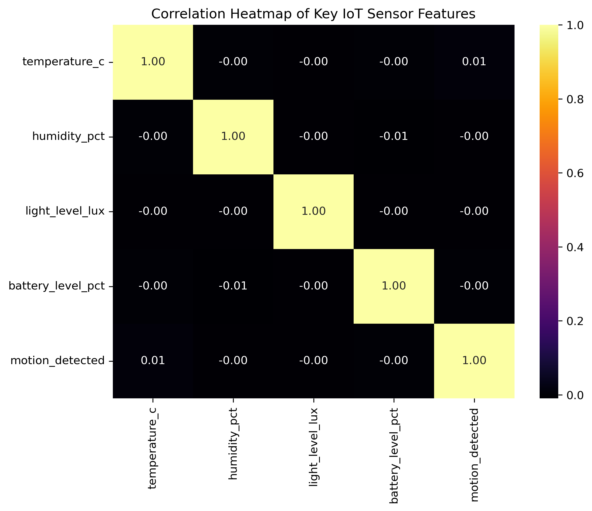
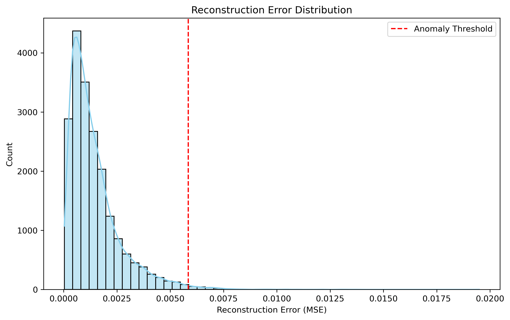
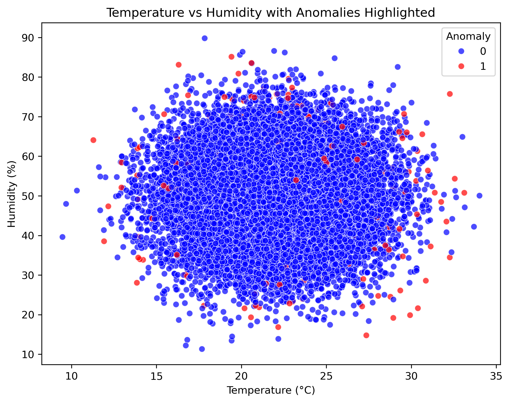

# 🔐 Data Privacy & Security in IoT

<p align="center">
  <b>A privacy-preserving IoT data pipeline combining encryption, hashing, and deep-learning-based anomaly detection.</b>
</p>

<p align="center">
  <a href="https://github.com/Prabhu-Jethi/Data_Privacy_in_IoT">
    
  </a>
  
  
  
  
  
</p>

---

## 📌 Overview

Internet of Things (IoT) devices continuously generate telemetry containing information about devices, locations, users, environmental conditions, and device state.

The problem is that IoT data is not inherently trustworthy or private.

If sensitive information is stored in plaintext, compromised storage, unauthorized access, or data leakage can expose user or device information. At the same time, abnormal sensor behavior can indicate faulty devices, manipulated telemetry, or potentially suspicious activity.

This project builds a **privacy and anomaly-detection pipeline for IoT sensor data**.

The system:

1. Generates a realistic synthetic IoT dataset.
2. Identifies sensitive fields.
3. Encrypts location information.
4. Hashes user identity information.
5. Removes plaintext sensitive values from the processed dataset.
6. Standardizes telemetry features.
7. Trains a lightweight neural-network reconstruction model.
8. Calculates reconstruction error for each observation.
9. Uses a percentile-based threshold to flag anomalous records.
10. Exports protected data and anomaly results for further analysis.

---

# 🎯 The Problem

### What problem does this project solve?

IoT environments produce large volumes of continuously changing sensor data. A single dataset can contain both:

* **Sensitive information**

  * User names
  * Locations
  * Device identifiers
* **Operational telemetry**

  * Temperature
  * Humidity
  * Light intensity
  * Motion
  * Battery level
  * Event timestamps

Storing and processing these values directly creates two major problems.

### 1. Data Privacy

Sensitive information such as user identity and physical location should not remain exposed in plaintext.

For example:

```text
user_name = Michael Cardenas
location  = Schultzton
```

If this dataset is compromised, an attacker could potentially associate a person with a physical location.

### 2. Suspicious or Abnormal Telemetry

Even when sensitive fields are protected, IoT systems still need to identify unusual sensor behavior.

Anomalous observations may result from:

* Sensor malfunction
* Unusual environmental conditions
* Data corruption
* Unexpected device behavior
* Potential data manipulation

Therefore, protecting IoT data requires more than encryption alone.

The system needs both:

> **Privacy protection + behavioral anomaly detection**

---

# 💡 How I Solved It

The project uses a multi-stage pipeline:

```text
                ┌─────────────────────┐
                │   Synthetic IoT     │
                │    Data Generation  │
                └──────────┬──────────┘
                           │
                           ▼
                ┌─────────────────────┐
                │ Data Preprocessing   │
                │ & Exploration       │
                └──────────┬──────────┘
                           │
              ┌────────────┴────────────┐
              │                         │
              ▼                         ▼
     ┌─────────────────┐       ┌─────────────────┐
     │ Sensitive Data  │       │ Telemetry Data  │
     │ Protection      │       │ Processing      │
     └────────┬────────┘       └────────┬────────┘
              │                         │
       ┌──────┴──────┐                  ▼
       │             │          ┌─────────────────┐
       ▼             ▼          │ StandardScaler  │
   Encryption     Hashing       └────────┬────────┘
       │             │                   │
       │             │                   ▼
       │             │          ┌─────────────────┐
       │             │          │ Neural Network  │
       │             │          │ Reconstruction  │
       │             │          └────────┬────────┘
       │             │                   │
       │             │                   ▼
       │             │          ┌─────────────────┐
       │             │          │ Reconstruction  │
       │             │          │ Error           │
       │             │          └────────┬────────┘
       │             │                   │
       │             │                   ▼
       │             │          ┌─────────────────┐
       │             │          │ 99th Percentile │
       │             │          │ Threshold       │
       │             │          └────────┬────────┘
       │             │                   │
       └─────────────┴───────────────────┤
                                         ▼
                              ┌─────────────────────┐
                              │ Protected Dataset  │
                              │ + Anomaly Results  │
                              └─────────────────────┘
```

---

# 🔢 Dataset

The project generates **20,000 synthetic IoT sensor records** using Faker, NumPy, and Pandas.

Each record contains:

| Feature             | Description               | Role              |
| ------------------- | ------------------------- | ----------------- |
| `sensor_id`         | Unique sensor identifier  | Device metadata   |
| `location`          | Simulated sensor location | Sensitive         |
| `user_name`         | Simulated user identity   | Sensitive         |
| `temperature_c`     | Temperature reading       | Telemetry         |
| `humidity_pct`      | Humidity percentage       | Telemetry         |
| `light_level_lux`   | Light intensity           | Telemetry         |
| `motion_detected`   | Binary motion indicator   | Telemetry         |
| `battery_level_pct` | Battery percentage        | Telemetry         |
| `event_time`        | Sensor event timestamp    | Temporal metadata |

The dataset is synthetic and is intended for experimentation rather than representing real users or real-world IoT deployments.

---

# 🔐 Privacy Protection

## Location Encryption

Location data is protected using the `Fernet` implementation from the Python `cryptography` package.

```python
from cryptography.fernet import Fernet

key = Fernet.generate_key()
fernet = Fernet(key)

def encrypt_value(val):
    return fernet.encrypt(val.encode()).decode()
```

The original location is transformed into encrypted ciphertext:

```text
Original:
Schultzton

Protected:
gAAAAABo7SNUHfRL37c4nh8N7a8GdHZ...
```

The original plaintext location is then removed from the processed DataFrame.

### Why encryption?

Encryption provides **confidentiality** while retaining the ability to decrypt the value when the appropriate key is available.

---

## 👤 User Identity Hashing

User names are processed using SHA-256:

```python
def hash_value(val):
    return hashlib.sha256(val.encode()).hexdigest()
```

The resulting dataset contains:

```text
user_name_hashed
```

instead of the original:

```text
user_name
```

### Why hashing?

Hashing is appropriate when the application needs a deterministic representation of an identifier without storing the original value directly.

Unlike encryption, a cryptographic hash is not intended to be decrypted.

---

# 🤖 Anomaly Detection

After protecting sensitive information, the project analyzes five numerical telemetry features:

```python
features = [
    "temperature_c",
    "humidity_pct",
    "light_level_lux",
    "battery_level_pct",
    "motion_detected"
]
```

The features are standardized using `StandardScaler`.

```text
Raw telemetry
      ↓
StandardScaler
      ↓
Normalized feature space
      ↓
Neural network
```

---

## 🧠 Neural Network Architecture

A lightweight reconstruction network is used:

```text
Input: 5 features
        ↓
Dense: 25 neurons
        ↓
Dense: 30 neurons
        ↓
Dense: 35 neurons
        ↓
Dense: 20 neurons
        ↓
Output: 5 features
```

The model contains approximately **2,840 trainable parameters**.

The model is trained to reconstruct the input telemetry.

The underlying idea is:

> Normal observations should be reconstructed relatively well, while unusual observations should produce larger reconstruction errors.

---

# 📐 Reconstruction Error

After training, the model reconstructs the standardized telemetry:

```python
x_pred = model.predict(x_scaled)
```

Mean Squared Error is calculated for each observation:

```python
mse = np.mean(
    np.power(x_scaled - x_pred, 2),
    axis=1
)
```

This produces:

```text
reconstruction_error
```

for every sensor record.

---

# 🚨 Anomaly Threshold

Instead of manually defining a fixed threshold, the project uses the **99th percentile** of reconstruction errors:

```python
threshold = np.percentile(mse, 99)
```

Records above this threshold are flagged:

```python
df["anomaly"] = (
    df["reconstruction_error"] > threshold
).astype(int)
```

Where:

```text
0 → Normal
1 → Anomaly
```

The resulting dataset is exported as:

```text
datas/anomaly_results.csv
```

---

# 📊 Results & Visual Analysis

The repository contains several visualizations used to inspect the IoT data and anomaly-detection behavior.

### Correlation Heatmap



### IoT Feature Pairplot


### Reconstruction Error Distribution



### Temperature vs Humidity Anomalies



These visualizations help inspect feature relationships, reconstruction errors, and the observations identified as anomalous.

---

# 📈 Project Metrics

| Metric                         |                                          Result |
| ------------------------------ | ----------------------------------------------: |
| Synthetic IoT records          |                                      **20,000** |
| Telemetry features used for ML |                                           **5** |
| Neural network parameters      |                                       **2,840** |
| Anomaly threshold              |                             **99th percentile** |
| Sensitive location field       |                            **Fernet encrypted** |
| User identity field            |                              **SHA-256 hashed** |
| ML approach                    | **Unsupervised reconstruction-based detection** |

The project metrics and implementation details are also reflected in the project's resume entry.

---

# 🛠️ Tech Stack

### Programming

* Python

### Data Processing

* Pandas
* NumPy
* Faker

### Data Visualization

* Matplotlib
* Seaborn

### Security

* Cryptography / Fernet
* SHA-256
* hashlib

### Machine Learning / Deep Learning

* Scikit-learn
* TensorFlow
* Keras
* StandardScaler
* Neural Network reconstruction model

---

# 📁 Repository Structure

```text
Data_Privacy_in_IoT/
│
├── datas/
│   ├── iot_data.csv
│   ├── encrypted_iot_data.csv
│   └── anomaly_results.csv
│
├── plots/
│   ├── corr_heatmap.png
│   ├── pairplot_iot_features.png
│   ├── reconstruction_error.png
│   └── scatterplot_temp_humid_anomaly.png
│
├── main.ipynb
├── requirements.txt
└── README.md
```

---

# 🚀 Getting Started

## 1. Clone the Repository

```bash
git clone https://github.com/Prabhu-Jethi/Data_Privacy_in_IoT.git
```

## 2. Navigate to the Project

```bash
cd Data_Privacy_in_IoT
```

## 3. Install Dependencies

```bash
pip install -r requirements.txt
```

## 4. Launch Jupyter Notebook

```bash
jupyter notebook main.ipynb
```

## 5. Run the Notebook

Execute the notebook cells sequentially.

The pipeline will:

```text
Generate IoT data
       ↓
Save raw dataset
       ↓
Encrypt location
       ↓
Hash user identity
       ↓
Remove plaintext sensitive fields
       ↓
Standardize telemetry
       ↓
Train neural network
       ↓
Calculate reconstruction error
       ↓
Flag anomalies
       ↓
Save results
```

---

# 📂 Generated Outputs

### `datas/iot_data.csv`

Contains the generated synthetic IoT dataset.

### `datas/encrypted_iot_data.csv`

Contains the privacy-protected dataset with:

* Encrypted location
* Hashed user identity
* Telemetry features

### `datas/anomaly_results.csv`

Contains the protected dataset plus:

* `reconstruction_error`
* `anomaly`

---

# 🔍 What This Project Demonstrates

This project demonstrates the combination of **data engineering, cybersecurity, and machine learning** rather than treating them as isolated tasks.

### Data Engineering

* Synthetic data generation
* Data transformation
* Feature selection
* CSV-based data pipeline

### Cybersecurity

* Encryption of sensitive data
* Cryptographic hashing
* Removal of plaintext sensitive fields

### Machine Learning

* Feature standardization
* Neural-network reconstruction
* Reconstruction-error analysis
* Unsupervised anomaly detection

### Data Analysis

* Exploratory data analysis
* Correlation analysis
* Feature relationship visualization
* Anomaly visualization

---

# ⚠️ Current Limitations

This project is a prototype and should not be presented as a production-grade IoT security platform.

### 1. Synthetic Data

The dataset is generated using Faker and statistical distributions.

Real IoT data will contain:

* Device-specific behavior
* Sensor noise
* Missing values
* Temporal dependencies
* Sensor drift
* Real attack patterns

Therefore, performance on this dataset does **not** establish real-world detection performance.

### 2. No Ground-Truth Attack Labels

The anomaly detector identifies observations with unusually high reconstruction error.

It does not currently distinguish between:

```text
Sensor failure
Environmental event
Data corruption
Cyberattack
```

A detected anomaly should therefore be interpreted as a **threat-indicative outlier**, not automatically as a confirmed cyberattack.

### 3. Encryption Key Management

The notebook generates a Fernet key during execution.

A production system would require proper:

* Key storage
* Key rotation
* Access control
* Key revocation
* Secrets management

### 4. Offline Notebook Pipeline

The current implementation runs as a Jupyter Notebook rather than a continuously operating IoT security service.

It does not currently provide:

* Real-time ingestion
* Streaming anomaly detection
* API endpoints
* Authentication
* Alerting
* Cloud deployment

---


# 🧠 Key Takeaway

The core idea of this project is:

> **IoT security should protect sensitive information while also identifying abnormal behavior in the data generated by connected devices.**

The implementation combines:

```text
Privacy
  ├── Fernet Encryption
  └── SHA-256 Hashing

        +

Machine Learning
  ├── Standardization
  ├── Neural Network Reconstruction
  └── Reconstruction Error

        ↓

Protected IoT Data
        +
Anomaly Detection
```

---

# 👨‍💻 Author

**Prabhudatta Jethi**

* GitHub: https://github.com/Prabhu-Jethi
* Project: https://github.com/Prabhu-Jethi/Data_Privacy_in_IoT

---

# 📜 License

This project is licensed under the **MIT License**.

You are free to use, modify, and distribute the project with appropriate attribution.
